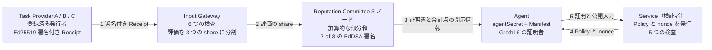

# zkAgent Passport

AI エージェントのための、選択的開示による評判クレデンシャル。

エージェントは、個別の評価・取引先・合計点、そしてクレデンシャルそのものを渡すことなく、「特定のタスク領域で、宣言した構成のまま、サービスの求める条件を満たしている」ことをサービスに証明します。

本リポジトリは、プロジェクト仕様に記したプロトコルの MVP を Go と [gnark](https://github.com/Consensys/gnark) で実装したものです。ローカルで完結し、CLI を中心に構成しています。

英語版は [README.md](README.md) にあります。

## 構成



証明書は Agent で止まります。5 の矢印が運ぶのは Groth16 の証明と、その公開入力 20 個だけです。内訳は、サービス自身が公開した Policy の 9 項目と challenge の 3 項目、サービスが信頼する Committee の鍵セット、そして nullifier です。

| 層 | 採用したもの |
|---|---|
| 言語・実行環境 | Go 1.25。外部サービス不要 |
| 証明系 | BN254 上の Groth16（gnark） |
| 回路内のハッシュとコミットメント | Poseidon2 |
| Committee の署名 | BabyJubJub 上の EdDSA（チャレンジは MiMC）。回路内で検証 |
| Provider の署名 | Ed25519。Gateway が検証 |
| 評価の集計 | 3 者間の加算的秘密分散 |
| ブラウザデモ | Go の `net/http` と埋め込み HTML 1 枚。CDN 不使用 |

## 前提

- Go 1.25 以降

## デモを動かす

```bash
go run ./cmd/demo
```

初回は回路をコンパイルし、開発専用の Groth16 セットアップを実行して、鍵を `artifacts/` にキャッシュします。この鍵を本番の trusted setup として使わないでください。デモは 4 つのケースを表示します。通常の認可、許可された構成変更（許可リストにある新しいモデル）の後の認可、許可されない構成変更（権限範囲の拡大）の拒否、そして再送の拒否です。

## ブラウザデモを動かす

```bash
go run ./cmd/web
```

http://127.0.0.1:8080 を開きます。実行するたびに本物のプロトコルが走り、6 つのステップが順に描画されます。Receipt の発行、Gateway の検査と秘密分散、Committee の部分和と証明書、Policy と nonce、証明の生成、そして検証です。各ステップには「これは何のための手順か」を 1 行で添えてあります。再生中の画面に出るのは流れだけで、開示の対比は「Service から何が見えるか」タブに畳んであります。そこでサービスに見えるものと決して見えないものを並べ、最後に残る限界（現在の Manifest のコミットメントだけは公開入力に残ること）を明示します。チェックを入れると、隠されている値を観客向けに開けます。

画面の冒頭は、扱っている場面そのもの（旅行予約を代行する AI エージェントに高い権限を渡してよいか）と、6 つのボタンです。ボタンは機能名ではなく問いになっています。中身を見せずに合格できるか、同じ取引先が 2 回評価したら実績を水増しできるか、モデルを更新しても実績は残るか、権限範囲を勝手に広げたらどうなるか、証明を拾って再利用できるか、2 つのサービスが記録を突き合わせたら同一のエージェントだと分かるか。押すと条件が設定され、本物のプロトコルが走り、流れの上に「答え」が 1 行で出ます。

「手動で試す」を開くと、3 件の評価、Policy の閾値と最低件数、Agent の現在の Manifest、Policy がモデル更新に対して持つ許可リスト、そして攻撃者モードと「別の Service で実行」がまとまっています。その他の失敗ケース（閾値未達、件数不足）も、ここから見せられます。

攻撃者モードは、不正な Receipt を Gateway に提出します。評価を書き換えたもの、未登録の Provider によるもの、重複、同一 Provider の 2 件目、期限切れの 5 種類で、それぞれどの検査が止めたかを表示します。「別の Service で実行」は 2 つ目の検証者に対して証明し、2 つの nullifier を流れの末尾に並べます。値が異なるので、両者は訪問を突き合わせられません。このページは外部依存を持たず、オフラインで動きます。

## Agent を単発プロセスとして動かす

パスポートの保持者は常駐プロセスである必要がありません。`cmd/agent` は自分の身元をファイルまたは環境変数から読み込み、仕事を 1 つ済ませて終了します。`cmd/service` は検証者を別プロセスにしたもので、nonce の管理を実行の合間もファイルに保持します。

```bash
go run ./cmd/agent init                      # passport.json（0600）と declaration.json
go run ./cmd/agent enroll                    # certificate.json。service.json に Committee の鍵セットが入る
go run ./cmd/service challenge               # 新しい nonce を含む challenge.json
go run ./cmd/agent prove                     # proof.json を書いてプロセスは終了
go run ./cmd/service verify                  # AUTHORIZED。もう一度実行すると再送として拒否される
go run ./cmd/agent update-manifest -model gpt-demo-v2   # 既定の Version Policy で許可される
go run ./cmd/agent update-manifest -scope travel-booking-admin   # 許可されないので証明を作れない
```

状態は `agent-state/` に置かれます（`-dir` または `AGENT_STATE_DIR` で変更可能）。`AGENT_SECRET` と `PASSPORT_SALT` は証明時にファイルの値を上書きします。サーバーレス環境が秘密を注入する形と同じです。Agent と Service は同じ `artifacts/` の鍵を共有する必要があります。`proof.json` に入るのは証明とその公開入力だけで、証明書は Agent 自身の状態に留まります。

## 計測する

```bash
go run ./cmd/bench -n 20
```

制約数、各ガジェットを単独でコンパイルして得た内訳、そして繰り返し実行した証明時間と検証時間を、Markdown で出力します。

## テストを実行する

```bash
go test ./...
```

31 のケースが、認可の成功、許可された構成変更、そして次の拒否を確認します。閾値未満の合計点、件数不足、他人の秘密での証明、証明より先に切れる証明書、Committee の署名が 1 件だけ、鍵セット外の署名、変更不可の Manifest 項目の変更、許可リスト外の値、strict な Policy での任意の変更、Agent が開けない Manifest を要求する Policy、偽造・未登録・重複・同一 Issuer の Receipt、すでに証明書を出したバッチの再集計、期限切れの証明、改ざんされた nullifier、別の challenge 向けの証明、検証者が challenge していない Policy 向けに作った証明、検証者が発行していない challenge、そして nonce の再送です。うち 2 件は体の符号化を押さえます。このコードが外に出す要素は必ず正規の 10 進表記であり、gnark-crypto なら小さな負数として表示してしまう「法のすぐ下」の値も例外ではない、という不変条件です。

プライバシーの主張を直接固定するテストが 2 つあります。1 つは 2 つのサービスに対して証明し、nullifier が異なることと、公開入力に証明書由来の値が現れないことを確認します。もう 1 つは、どの公開入力を改ざんしても証明が無効になることを確認します。

## リポジトリの構成

ルート直下の 4 つのパッケージがプロトコル本体です。それを見せるためだけに存在するものは `internal/` に、実行可能なコマンドは `cmd/` にまとめてあります。

```text
field/          体の演算、Poseidon2 のハッシュ、コミットメント
passport/       Agent、Receipt、Gateway、Committee、Policy、challenge、証明者
zkp/            PassportCircuit と Groth16 の証明・検証
verifier/       サービス側の検証
internal/demo/  固定のデモ参加者と e2e テスト
internal/store/ Agent と Service のプロセス間でやり取りする JSON の形式
cmd/demo/       CLI デモ
cmd/web/        ブラウザデモ（Go の HTTP サーバーと埋め込み HTML 1 枚）
cmd/agent/      単発の Agent プロセス（init、enroll、update-manifest、prove）
cmd/service/    検証者プロセス（challenge、verify）。nonce の状態を永続化
cmd/bench/      制約の内訳と時間の計測
docs/slides/    5 分の発表スライド、生成スクリプト、発表プラン
```

## Apple Silicon Mac での実測（`go run ./cmd/bench -n 20`）

| 項目 | 値 |
|---|---|
| 制約数（Groth16 / BN254） | 28,596 |
| 公開入力 | 20 |
| 証明の生成 | 中央値 55 ms（54〜60 ms） |
| 証明の検証 | 1 ms 未満 |
| 証明のサイズ | 164 bytes |
| コンパイルとセットアップ（初回） | 約 1 秒 |

| 構成要素 | 制約数 | 割合 |
|---|---:|---:|
| Committee の署名（BabyJubJub 上の EdDSA、2 本） | 15,538 | 54% |
| Manifest Version Policy（4 項目、各 leaf + 深さ 4 の Merkle + 判定） | 6,776 | 24% |
| 証明書のハッシュ（10 入力） | 1,861 | 7% |
| Manifest の開示（4 入力 × 2） | 1,490 | 5% |
| Policy のハッシュ（8 入力） | 1,489 | 5% |
| コミットメントの開示（score、passport、nullifier） | 1,119 | 4% |
| 32bit の比較（score、件数、期限） | 297 | 1% |
| 鍵セットの選択と署名者の相異 | 22 | 0% |

回路は 2 段階で大きくなりました。この推移が、それぞれのプライバシー特性の値段を示しています。公開された証明書に対する閾値の証明は 3,829 制約で約 17 ms でした。Manifest Version Policy を加えると 12,570 制約で 34 ms になります。証明書を隠すための本体である Committee 定足数の回路内検証が、残りを占めます。

# Design Notes

## 検証者が知ること

| 値 | 検証者に渡るか |
|---|---|
| 個別の Receipt、個別の評価、Provider 名 | 渡らない |
| 合計点と、そのコミットメントを開く乱数 | 渡らない |
| Receipt の件数 | 渡らない |
| 証明書の ID・ハッシュ・署名・発行時刻・期限 | 渡らない |
| passportCommitment、passportSalt、agentSecret | 渡らない |
| 認定時の Manifest コミットメントと、Manifest の各項目の値 | 渡らない |
| nullifier（`Hash(agentSecret, verifierId)`） | 渡る |
| 現在の Manifest コミットメント | 渡る。Policy が指定する値のため |
| Policy、challenge、Committee の鍵セット | 渡る。検証者自身が公開した値 |

検証者が得る Agent 固有の値は nullifier だけです。同じ検証者に対しては同じ値になるので、再訪の把握やサービス内での重複利用の制限に使えます。一方、他の検証者が受け取る nullifier とは無関係なので、2 つのサービスが情報を突き合わせても、同じ Agent を相手にしたとは分かりません。

ただし経路が 1 つ残っています。Policy は特定の Manifest コミットメントを条件に指定するため、その値は公開されます。Manifest はモデル・プロンプト・ツール・権限範囲の宣言であり、同じ構成で動く Agent はすべて同じ値を共有するので、個体ではなくグループを識別します。許可される Manifest の集合を指定し、その集合への包含を証明する形にすれば、この経路も閉じられます。Version Policy が持つ Merkle の仕組みを、そのまま使えます。

## なぜ Committee の証明書ではなく証明なのか

Committee が「この Agent は 12 点以上である」と署名すれば済むように見えます。これは 2 つの理由で成り立ちません。閾値も Version Policy もサービスごとに異なるため、Agent は新しい条件が出るたびに Committee へ依頼し直すことになります。そして、その依頼の履歴自体が、Agent が満たしている閾値を明らかにします。証明であれば、1 通の証明書でどんな Policy にも、Committee を介さずに、依頼元のサービスと 1 回限りの使用に束縛された形で答えられます。

## 回路

- 回路内のハッシュとコミットメントはすべて Poseidon2 です。SHA-256 は、識別子を体の要素に写す境界でのみ使います。EdDSA のチャレンジハッシュは MiMC で、gnark の署名ガジェットが要求する形式です。
- 公開入力 20 個の内訳は、Policy の 9 項目、challenge の 3 項目、nullifier、鍵セットの ID、そして 3 本の公開鍵（各 2 座標）です。証明書に関するものはすべて秘密入力です。
- Committee の署名は、その鍵セットに対して回路内で検証します。2 本の署名はそれぞれ鍵セットへの秘密のインデックスを持ち、2 ビット分解で選択します。この分解は範囲外の値も同時に拒否します。2 つのインデックスは異なる必要があるため、1 つのノードが 2 回署名することはできません。
- Receipt に付く Provider の署名は Ed25519 のままで、Gateway が回路の外で検証します。検証者には届きません。これを回路内で検証するとすべての Receipt を読むことになり、必要でもなく現実的でもありません。
- 合計点、Receipt の件数、証明書の期限は、対応する公開値と符号なし 32bit として比較します。両辺を範囲検査するので、差が体の中で巻き戻ることはありません。
- Groth16 は、どの制約にも現れない公開入力を証明に束縛しません。ここでは nonce 以外のすべての公開入力が何らかの制約で使われるため、nonce にだけ非ゼロ制約を置いています。これにより、再送は検証者の帳簿だけでなく証明のレベルで失敗します。
- 検証者は、自分の Policy・challenge・鍵セットから公開入力を組み立て直し、証明者から取るのは nullifier だけです。したがって別の主張に対する証明は、ペアリング検査そのもので落ちます。

## Manifest binding

評判は名前ではなく `Hash(modelId, systemPromptHash, toolPolicyHash, permissionScope)` に紐付きます。どれか 1 つでも変えればコミットメントが変わるので、構成を変えた Agent が、置き換えられた側の実績を黙って引き継ぐことはありません。人間の評判システムには必要なく、Agent の評判システムには欠かせない性質です。

とはいえ厳格な束縛は、プロンプトの修正 1 つで実績を失わせます。そこで Policy は変更を許可できます。Policy は変更可能な項目のビットマスクと、（項目, 値）の許可リストの Merkle root を持ち、どちらも Policy のハッシュに束縛されます。回路は認定時と現在の Manifest コミットメントの両方を開き、各項目について「同じである」か「変更可のビットが立っていて、新しい値の包含経路が正しい」かのどちらかを要求します。strict な Policy はマスクがゼロの場合で、単なる一致に帰着します。

## 再送の防止

証明は譲渡可能なオブジェクトなので、nonce を含めるだけでは足りません。検証者が nonce を発行し、その nonce と一緒に公開した Policy のハッシュを添えて未使用として記録し、その Policy 向けに自分が発行した nonce だけを受理し、成功時に消費します。証明は `verifierId`・`nonce`・`proofExpiresAt`・`policyHash` に束縛されるので、別のサービスへの転用、別の条件への転用、期限切れ、2 回目の使用のすべてを拒否できます。

## 整合性はモデル層にある

- `ValidatedReceipt` を作れるのは Gateway だけで、Committee はそれ以外を集計しません。検査を通っていない Receipt が合計点に届くことはありません。
- challenge を発行するのは検証者だけで、自分が発行した nonce しか受理しません。自作の nonce に束縛された証明は通りません。nonce にはそれを発行したときの Policy が結び付いているので、条件の緩い別の Policy 向けに作った証明を、この検証者の challenge に対して出すこともできません。
- 検証者と Gateway は自分の検査の順序を保持し、各検査の結果を返します。画面はその結果を描画するだけで、順序を推測し直しません。
- 証明書が隠れたことで、検証者自身の検査は 5 つに減りました。証明が期限内か、Policy のハッシュが Policy と一致するか、nonce をこの Policy 向けにここで発行したか、未使用か、証明が正しいかです。証明書の期限・Committee の定足数・Policy との一致は、検査するのではなく証明されます。

## 信頼の前提と対象外

本 MVP は、Issuer Registry・Input Gateway・Committee を固定された信頼できる参加者として扱います。

- 登録済みの Provider は正しい Receipt を発行します。偽レビュー、Review Farming、Sybil、Issuer との共謀は、ここで暗号が解決する範囲の外です。Gateway の検査はコストを上げますが、なくすものではありません。
- Gateway は平文の評価を見ます。秘密分散が隠すのは Committee のノードからであって、Gateway からではありません。Gateway をなくすなら、Provider が Committee へ直接秘密分散し、評価の範囲は検査ではなく証明する形になります。
- Committee は semi-honest で、3 ノードはここでは 1 プロセス内で動くため、集計は分散プロトコルではなく忠実なシミュレーションです。加算的秘密分散は 3 つの部分和がすべて揃う必要があり、Shamir 方式ならこの制約は緩みます。
- 2 件の署名は、1 ノード単独での証明書発行を防ぎます。悪意ある 2 ノードには耐えられません。
- Manifest が束縛するのは宣言であって実行ではありません。宣言どおりのモデルとツールで実際に動いたかは Remote Attestation の問題で、TEE の技術はこれと競合するのではなく組み合わさります。
- ここでの Groth16 のセットアップは単一者によるもので、開発専用です。
- 証明書の失効機構と、真の閾値署名は実装していません。
- 検証者の nonce の帳簿は増える一方です。使われずに期限切れになった pending は掃除されず、消費済みの nonce も永久に残ります。`proofExpiresAt` を過ぎた分を捨てるのは健全ですが（`proof-unexpired` が nonce の検査より先に期限切れの証明を落とすため）、実装していません。
- プロトコルの型は同時利用を想定していません。`cmd/service` は状態ファイルをアトミックにではなく、その場で上書きします。ブラウザデモはパッケージ側を並行化するのではなく、mutex でリクエストを直列化しています。

回路に入る識別子は有限体の符号化を使うため、デモでは `taskDomain`・`aggregationEpoch`・鍵セットのバージョンに数値の識別子を使います。人が読む名前はアプリケーションの境界に留めています。
