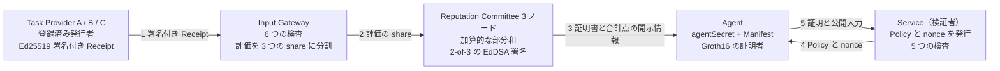

# zkAgent Passport

<picture>
  <source media="(prefers-color-scheme: dark)" srcset="docs/images/agent-robot-dark.svg">
  
</picture>

**AI エージェントのための、選択的開示による評判クレデンシャル。**

エージェントは、個別の評価・取引先・合計点、そしてクレデンシャルそのものを渡すことなく、「特定のタスク領域で、宣言した構成のまま、サービスの求める条件を満たしている」ことをサービスに証明します。

Go と [gnark](https://github.com/Consensys/gnark) による MVP です。BN254 上の Groth16、回路内は Poseidon2、Committee の 2-of-3 EdDSA 署名を証明の中で検証します。ローカルで完結し、外部サービスを必要としません。

英語版は [README.md](README.md)。設計の詳細は [docs/design-notes.ja.md](docs/design-notes.ja.md)。

## サービスに何が渡り、何が渡らないか

| 検証者に渡るもの | Agent の手元に残るもの |
|---|---|
| 検証者自身が公開した Policy と challenge | 個別の評価と、それを付けた Provider |
| 信頼している Committee の鍵セット | 合計点、Receipt の件数 |
| nullifier（`Hash(agentSecret, verifierId)`） | 証明書の ID・署名・発行時刻・期限 |
| 現在の Manifest コミットメント | agentSecret、passportCommitment、認定時の Manifest |

検証者が得る Agent 固有の値は nullifier だけです。同じ検証者に対しては同じ値になるので、再訪の把握やサービス内での重複利用の制限に使えます。一方、他の検証者が受け取る nullifier とは無関係なので、2 つのサービスが情報を突き合わせても、同じ Agent を相手にしたとは分かりません。

ただし経路が 1 つ残っています。Policy は特定の Manifest コミットメントを条件に指定するため、その値は公開されます。Manifest はモデル・プロンプト・ツール・権限範囲の宣言であり、同じ構成で動く Agent はすべて同じ値を共有するので、個体ではなくグループを識別します。許可される Manifest の集合への包含を証明する形にすれば、この経路も閉じられます。Version Policy が持つ Merkle の仕組みを、そのまま使えます。

## 仕組み



証明書は Agent で止まります。5 の矢印が運ぶのは Groth16 の証明と、その公開入力 20 個だけです。内訳は、サービス自身が公開した Policy の 9 項目と challenge の 3 項目、サービスが信頼する Committee の鍵セット、そして nullifier です。

**なぜ Committee の証明書ではなく証明なのか。** Committee が「この Agent は 12 点以上である」と署名すれば済むように見えます。しかし閾値も Version Policy もサービスごとに異なるため、Agent は新しい条件が出るたびに Committee へ依頼し直すことになり、その依頼の履歴自体が、Agent が満たしている閾値を明らかにします。証明であれば、1 通の証明書でどんな Policy にも、Committee を介さずに、依頼元のサービスと 1 回限りの使用に束縛された形で答えられます。

## 動かす

Go 1.25 以降が必要です。初回は回路をコンパイルし、開発専用の Groth16 セットアップを実行して、鍵を `artifacts/` にキャッシュします。この鍵を本番の trusted setup として使わないでください。

### ブラウザデモ

```bash
go run ./cmd/web
```

http://127.0.0.1:8080 を開きます。待ち受けアドレスは `-addr` か環境変数 `PORT` で変えられます。押すたびに本物のプロトコルが走り、6 つのステップが順に描画されます。Receipt の発行、Gateway の検査と秘密分散、Committee の部分和と証明書、Policy と nonce、証明の生成、そして検証です。

冒頭にあるのは、扱っている場面そのもの（旅行予約を代行する AI エージェントに高い権限を渡してよいか）と、6 つのボタンです。ボタンは機能名ではなく問いになっています。

- 中身を見せずに合格できるか
- 同じ取引先が 2 回評価したら実績を水増しできるか
- モデルを更新しても実績は残るか
- 権限範囲を勝手に広げたらどうなるか
- 証明を拾って再利用できるか
- 2 つのサービスが記録を突き合わせたら同一のエージェントだと分かるか

開示の対比は「Service から何が見えるか」タブにあり、チェックを入れると隠されている値を観客向けに開けます。「手動で試す」を開くと、3 件の評価、Policy の閾値と最低件数、Agent の Manifest、モデル更新の許可リスト、Gateway に提出する 5 種類の不正な Receipt、「別の Service で実行」がまとまっています。攻撃はどの検査が止めたかを表示し、「別の Service で実行」は 2 つの nullifier を流れの末尾に並べます。値が異なるので、両者は訪問を突き合わせられません。外部依存を持たず、オフラインで動きます。

### コマンドライン

```bash
go run ./cmd/demo
```

通常の認可、許可された構成変更の後の認可、許可されない構成変更の拒否、再送の拒否を表示します。

### Agent を単発プロセスとして動かす

パスポートの保持者は常駐プロセスである必要がありません。`cmd/agent` は自分の身元をファイルまたは環境変数から読み込み、仕事を 1 つ済ませて終了します。`cmd/service` は検証者を別プロセスにしたもので、nonce の管理を実行の合間もファイルに保持します。

```bash
go run ./cmd/agent init                      # passport.json（0600）と declaration.json
go run ./cmd/agent enroll                    # certificate.json。service.json に Committee の鍵セットが入る
go run ./cmd/service challenge               # 新しい nonce を含む challenge.json
go run ./cmd/agent prove                     # proof.json を書いてプロセスは終了
go run ./cmd/service verify                  # AUTHORIZED。もう一度実行すると再送として拒否される
go run ./cmd/agent update-manifest -model gpt-demo-v2           # 既定の Version Policy で許可される
go run ./cmd/agent update-manifest -scope travel-booking-admin  # 許可されないので証明を作れない
```

状態は `agent-state/` に置かれます（`-dir` または `AGENT_STATE_DIR` で変更可能）。`AGENT_SECRET` と `PASSPORT_SALT` は証明時にファイルの値を上書きします。サーバーレス環境が秘密を注入する形と同じで、2 つは対で指定する必要があります。Agent と Service は同じ `artifacts/` の鍵を共有します。`proof.json` に入るのは証明とその公開入力だけで、証明書は Agent 自身の状態に留まります。

### テストと計測

```bash
go test ./...
```

```bash
go run ./cmd/bench -n 20
```

32 のケースが、認可の成功、許可された構成変更、そしてプロトコルが拒否すべきものすべてを確認します。閾値未満の合計点、件数不足、他人の秘密での証明、証明より先に切れる証明書、Committee の署名が 1 件だけ、鍵セット外の署名、変更不可の Manifest 項目の変更、許可リスト外の値、すでに証明書を出したバッチの再集計、偽造・重複の Receipt、nonce の再送などです。うち 2 件はプライバシーの主張を直接固定します。1 つは 2 つのサービスに対して証明し、nullifier が異なることと公開入力に証明書由来の値が現れないことを確認します。もう 1 つは、どの公開入力を改ざんしても証明が無効になることを確認します。

`cmd/bench` は、制約数、各ガジェットを単独でコンパイルして得た内訳、繰り返し実行した証明時間と検証時間を Markdown で出力します。

## 実測値

Apple Silicon Mac で `go run ./cmd/bench -n 20` を実行した結果です。

| 項目 | 値 |
|---|---|
| 制約数（Groth16 / BN254） | 28,596 |
| 公開入力 | 20 |
| 証明の生成 | 中央値 55 ms（54〜60 ms） |
| 証明の検証 | 1 ms 未満 |
| 証明のサイズ | 164 bytes |
| コンパイルとセットアップ（初回） | 約 1 秒 |

証明書を隠しているのは Committee 定足数の回路内検証で、これが制約の 54% を占めます。ガジェットごとの内訳と、それぞれのプライバシー特性の値段は [design notes](docs/design-notes.ja.md#制約の内訳) にあります。

## リポジトリの構成

ルート直下の 4 つのパッケージがプロトコル本体です。それを見せるためだけに存在するものは `internal/` に、実行可能なコマンドは `cmd/` にまとめてあります。

```text
field/          体の演算、Poseidon2 のハッシュ、コミットメント
passport/       Agent、Receipt、Gateway、Committee、Policy、challenge、証明者
zkp/            PassportCircuit と Groth16 の証明・検証
verifier/       サービス側の検証
internal/demo/  固定のデモ参加者と e2e テスト
internal/store/ Agent と Service のプロセス間でやり取りする JSON の形式
cmd/demo/       CLI デモ
cmd/web/        ブラウザデモ（Go の HTTP サーバーと埋め込み HTML 1 枚）
cmd/agent/      単発の Agent プロセス（init、enroll、update-manifest、prove）
cmd/service/    検証者プロセス（challenge、verify）。nonce の状態を永続化
cmd/bench/      制約の内訳と時間の計測
docs/design-notes.ja.md  回路、Manifest binding、再送の防止、信頼の前提
```

## 信頼の前提

これは MVP です。Issuer Registry・Input Gateway・Committee は固定された信頼できる参加者として扱い、Committee の 3 ノードは 1 プロセス内で動き、Groth16 のセットアップは単一者による開発専用のものです。偽レビュー・Review Farming・Sybil は、ここで暗号が解決する範囲の外にあります。前提と対象外の全リストは [design notes](docs/design-notes.ja.md#信頼の前提と対象外) にあります。

## ライセンス

Apache License 2.0 です。[LICENSE](LICENSE) を参照してください。
