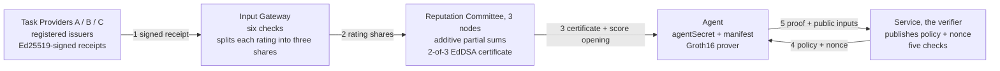

# zkAgent Passport

Selective-disclosure reputation credentials for AI agents.

An agent proves to a service that it meets the service's conditions in a task
domain, under a declared configuration, without handing over its individual
ratings, its counterparties, its total score, or even the credential itself.

This repository implements a local, CLI-first MVP of the protocol described in
the project specification, written in Go on
[gnark](https://github.com/Consensys/gnark).

A Japanese version of this document is in [README.ja.md](README.ja.md).

## Architecture



The certificate stops at the agent. Step 5 carries only a Groth16 proof and
its twenty public inputs: the nine policy fields and three challenge fields
the service itself published, the committee keyset it trusts, and a
nullifier.

| Layer | Choice |
|---|---|
| Language and runtime | Go 1.25, no external services |
| Proof system | Groth16 on BN254, via gnark |
| In-circuit hash and commitments | Poseidon2 |
| Committee signatures | EdDSA on BabyJubJub, MiMC challenge, verified in-circuit |
| Provider signatures | Ed25519, verified by the gateway |
| Score aggregation | Three-party additive secret sharing |
| Browser demo | Go `net/http` plus one embedded HTML page, no CDN |

## Prerequisites

- Go 1.25 or later

## Run the demo

```bash
go run ./cmd/demo
```

The first run compiles the circuit, runs a development-only Groth16 setup, and
caches the keys under `artifacts/`. Do not use these keys as a production
trusted setup. The demo prints an authorized access, an authorized access
after a permitted manifest update (a new model version on the allowlist), a
rejected manifest change (a widened permission scope), and a rejected replay.

## Run the browser demo

```bash
go run ./cmd/web
```

Then open http://127.0.0.1:8080. Every run executes the real protocol and
animates the six steps: receipts, gateway checks and secret sharing,
committee partial sums and certificate, policy and nonce, proof generation,
and verification. Each step carries a one-line note saying what it is for.
The page shows the trace and nothing else while it plays; a second tab,
"Service から何が見えるか", holds the disclosure contrast — what the service
learns, what it never sees, and the one limitation that survives: the
commitment to the current manifest stays public. A toggle reveals the hidden
values for an audience.

The page opens with the situation it is about — should a travel-booking agent
be given high privileges? — and six buttons, each one a question rather than
a feature name: can it pass without showing the contents, can a provider
inflate an agent's record by rating it twice, does a model upgrade keep the
record, what happens when the agent widens its own permission scope, can a
proof be copied and reused, and can two services put their records together
and recognise the same agent. Clicking one sets the conditions, runs the real
protocol, and answers it in a line above the trace.

Behind a "try it by hand" disclosure sit the controls and the attacker mode:
the three ratings, the policy threshold and minimum receipt count, the
agent's current manifest, the policy's allowlist for model versions, five bad
receipts to submit to the gateway (a rewritten rating, an unregistered
provider, a duplicate, a second receipt from the same provider, an expired
one), and a "run at another service" button. The other failure cases (score
below threshold, too few receipts) can be shown live from there.

Each attack shows which of the gateway's six checks stopped it. Proving to a
second verifier appends the two nullifiers to the trace, right where it
happens: different values, so the visits cannot be linked. The page has no
external dependencies and works offline.

## Run the agent as a single-shot process

The passport holder does not need to be a long-running process. `cmd/agent`
loads its identity from a file or from environment variables, does one job,
and exits; `cmd/service` is the verifier as a separate process that keeps
its nonce bookkeeping in a file between invocations.

```bash
go run ./cmd/agent init                      # passport.json (0600) and declaration.json
go run ./cmd/agent enroll                    # certificate.json; service.json gets the committee keyset
go run ./cmd/service challenge               # challenge.json with a fresh nonce
go run ./cmd/agent prove                     # proof.json, then the process exits
go run ./cmd/service verify                  # AUTHORIZED; run again to see the replay rejected
go run ./cmd/agent update-manifest -model gpt-demo-v2   # permitted by the default version policy
go run ./cmd/agent update-manifest -scope travel-booking-admin   # not permitted: prove fails
```

State lives under `agent-state/` (override with `-dir` or `AGENT_STATE_DIR`).
`AGENT_SECRET` and `PASSPORT_SALT` override the file at prove time, the way a
serverless deployment would inject them. The agent and the service must share
the same `artifacts/` keys. `proof.json` holds only the proof and its public
inputs; the certificate stays in the agent's own state.

## Measure

```bash
go run ./cmd/bench -n 20
```

Prints, as Markdown, the constraint count, a per-gadget breakdown obtained by
compiling each gadget in isolation, and proving and verification times over
repeated runs.

## Run the tests

```bash
go test ./...
```

Twenty-nine cases cover a successful authorization, permitted manifest
updates, and rejections for: a score below the threshold, too few receipts,
proving with someone else's secret, a certificate that expires before the
proof would, a single committee signature, a signature from outside the
keyset, an immutable manifest field changed, a manifest value outside the
allowlist, any change under a strict policy, a policy for a manifest the
agent cannot open, forged, unregistered, duplicate and same-issuer receipts,
a second aggregation of a batch already certified, an expired proof, a
tampered nullifier, a proof for another challenge, a proof built for a policy
the verifier did not challenge for, a challenge the verifier did not issue,
and a replayed nonce.

Two tests pin the privacy claims directly: one proves to two services and
checks that the nullifiers differ and that no certificate value appears in
the public inputs; another checks that tampering with any public input
invalidates the proof.

## Repository layout

The four packages at the root are the protocol itself. Everything that only
exists to demonstrate it lives under `internal/`, and every executable under
`cmd/`.

```text
field/          Field arithmetic, Poseidon2 hashing, commitments
passport/       Agent, receipts, gateway, committee, policy, challenge, prover
zkp/            PassportCircuit and the Groth16 prove/verify flow
verifier/       Service-side verification
internal/demo/  Fixed demo participants and end-to-end tests
internal/store/ JSON files exchanged between the agent and service processes
cmd/demo/       CLI demo
cmd/web/        Browser demo (Go HTTP server plus one embedded HTML page)
cmd/agent/      Single-shot agent process (init, enroll, update-manifest, prove)
cmd/service/    Verifier process (challenge, verify) with persisted nonce state
cmd/bench/      Constraint breakdown and timing
docs/slides/    The five-minute presentation deck, the script that builds it, and the plan behind it
```

## Measured on an Apple Silicon Mac (`go run ./cmd/bench -n 20`)

| Item | Value |
|---|---|
| Constraints (Groth16 / BN254) | 28,596 |
| Public inputs | 20 |
| Proof generation | 55 ms median (54 to 60 ms) |
| Proof verification | under 1 ms |
| Proof size | 164 bytes |
| Compile + setup (first run) | about 1 s |

| Component | Constraints | Share |
|---|---:|---:|
| Committee signatures (EdDSA on BabyJubJub, 2 of them) | 15,538 | 54% |
| Manifest version policy (4 fields, each leaf + depth-4 Merkle + checks) | 6,776 | 24% |
| Certificate hash (10 inputs) | 1,861 | 7% |
| Manifest openings (2 × 4 inputs) | 1,490 | 5% |
| Policy hash (8 inputs) | 1,489 | 5% |
| Commitment openings (score, passport, nullifier) | 1,119 | 4% |
| 32-bit comparisons (score, receipt count, expiry) | 297 | 1% |
| Keyset selection and signer distinctness | 22 | 0% |

The circuit grew in two steps, which makes the cost of each privacy property
visible. Proving a threshold against a public certificate takes 3,829
constraints and about 17 ms. Adding the manifest version policy brings it to
12,570 and 34 ms. Verifying the committee quorum in-circuit, which is what
hides the certificate, accounts for the rest.

# Design notes

## What the verifier learns

| Value | Reaches the verifier |
|---|---|
| Individual receipts, ratings, provider names | No |
| Total score, and the salt that opens its commitment | No |
| Receipt count | No |
| Certificate: id, hash, signatures, issue time, expiry | No |
| Passport commitment, passport salt, agent secret | No |
| Certified manifest commitment, and every manifest field value | No |
| Nullifier, `Hash(agentSecret, verifierId)` | Yes |
| Current manifest commitment | Yes, because the policy names it |
| Policy, challenge, committee keyset | Yes, the verifier published them |

The nullifier is the only agent-specific value a verifier obtains. It is
stable for that verifier, so repeat visits and per-service reuse limits are
possible, and it is unrelated to the nullifier any other verifier sees, so
two services comparing notes cannot tell they served the same agent.

One channel remains open. The policy asks about a specific manifest
commitment, so that value is public. A manifest is the declaration of model,
prompt, tools and permission scope, which every agent running the same
configuration shares, so it identifies a group rather than an individual.
Naming a set of acceptable manifests, and proving membership in it, would
close the gap; the version policy already carries the Merkle machinery this
would need.

## Why a proof rather than a committee attestation

The committee could simply sign "this agent scores at least 12". That fails
for two reasons. Thresholds and version policies differ per service, so the
agent would have to return to the committee for every new condition, and the
sequence of requests would itself reveal the thresholds it is meeting. A
proof lets one certificate answer any policy, offline, bound to the asking
service and to a single use.

## Circuit

- All in-circuit hashing and commitments use Poseidon2. SHA-256 is used only
  at the application boundary to map identifiers into the field. The EdDSA
  challenge hash is MiMC, which is what gnark's signature gadget expects.
- The twenty public inputs are nine policy fields, three challenge fields,
  the nullifier, the keyset id, and three public keys of two coordinates
  each. Everything about the certificate is a private witness.
- Committee signatures are verified inside the circuit against that keyset.
  Each of the two signatures carries a private index into the keyset,
  selected with a two-bit decomposition that also rejects the out-of-range
  value; the two indices must differ, so one node cannot sign twice.
- Provider signatures on receipts stay Ed25519 and are verified by the
  gateway outside the circuit. They never reach a verifier. Verifying them
  in-circuit would mean reading every receipt, which is neither needed nor
  affordable.
- Score, receipt count, and the certificate expiry are compared against their
  public counterparts as unsigned 32-bit values, with both operands
  range-checked so the difference cannot wrap around the field.
- Groth16 does not bind public inputs that appear in no constraint. Every
  public input here is used by some constraint except the nonce, which is
  therefore constrained to be non-zero. That is what makes replay fail at the
  proof level rather than only at the verifier's bookkeeping.
- The verifier rebuilds the public witness from its own policy, challenge and
  keyset, taking only the nullifier from the prover, so a proof for any other
  statement is rejected by the pairing check itself.

## Manifest binding

Reputation binds to `Hash(modelId, systemPromptHash, toolPolicyHash,
permissionScope)`, not to a name. Change any of them and the commitment
changes, so a reconfigured agent does not silently inherit the record of the
one it replaced. This is the property a human reputation system does not need
and an agent one cannot do without.

Strict binding would make every prompt fix cost the agent its history, so a
policy may permit change. It carries a bit mask of mutable fields and the
Merkle root of an allowlist of (field, value) pairs, both bound by the policy
hash. The circuit opens the certified and the current manifest commitments
and, for every field, requires either equality or a set mutable bit together
with a valid inclusion path for the new value. A strict policy is the mask
zero, which reduces to plain equality.

## Replay protection

A proof is a transferable object, so the nonce alone is not enough. The
verifier issues the nonce, records it as pending together with the hash of
the policy it published alongside it, accepts only nonces it issued for that
policy, and consumes it on success. The proof is bound to `verifierId`,
`nonce`, `proofExpiresAt` and `policyHash`, which rejects reuse at another
service, under another policy, after expiry, or a second time.

## Integrity lives in the model layer

- Only the gateway can produce a `ValidatedReceipt`, and the committee
  aggregates nothing else, so an unchecked receipt cannot reach a score.
- Only the verifier issues challenges, and it accepts only nonces it issued,
  so a proof cannot be bound to a self-made nonce. A nonce carries the policy
  it was issued for, so a proof made for some weaker policy cannot be
  presented against this verifier's challenge either.
- The verifier and the gateway own the order of their checks and report each
  outcome; user interfaces render that report instead of re-deriving it.
- With the certificate hidden, the verifier's own checks reduce to five: the
  proof is unexpired, the policy hash matches the policy, the nonce was
  issued here for this policy, the nonce is unused, and the proof verifies. Certificate
  expiry, the committee quorum and the policy match are proven, not checked.

## Trust assumptions and non-goals

The MVP keeps the Issuer Registry, the Input Gateway and the Committee fixed
and trusted.

- Registered providers issue honest receipts. Fake reviews, review farming,
  Sybil identities and collusion with an issuer are outside what cryptography
  settles here; the gateway's checks raise the cost but do not remove it.
- The gateway sees plaintext ratings. Secret sharing hides them from the
  committee nodes, not from the gateway. Removing the gateway would mean
  providers sharing directly to the committee, with the rating range proven
  rather than inspected.
- The committee is semi-honest and its three nodes run in one process here,
  so the aggregation is a faithful simulation rather than a distributed
  protocol. Additive sharing also needs all three partial sums, which a
  Shamir scheme would relax.
- Two signatures prevent a single node from issuing a certificate. They do
  not withstand two malicious nodes.
- A manifest binds a declaration, not an execution. Whether the agent really
  ran that model with those tools is a remote-attestation question, and TEE
  work composes with this rather than competing with it.
- The Groth16 setup here is single-party and for development only.
- Certificate revocation and real threshold signatures are not implemented.

Circuit-bound identifiers use finite-field encodings, so the demo uses
numeric identifiers for `taskDomain`, `aggregationEpoch` and keyset versions;
human-readable names stay at the application boundary.
