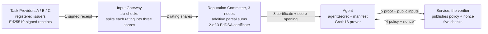

# zkAgent Passport

<picture>
  <source media="(prefers-color-scheme: dark)" srcset="docs/images/agent-robot-dark.svg">
  
</picture>

**Selective-disclosure reputation credentials for AI agents.**

An agent proves to a service that it meets the service's conditions in a task
domain, under a declared configuration, without handing over its individual
ratings, its counterparties, its total score, or even the credential itself.

A local, CLI-first MVP in Go on [gnark](https://github.com/Consensys/gnark).
Groth16 over BN254, Poseidon2 in-circuit, and a 2-of-3 committee whose EdDSA
signatures are verified inside the proof. No external services.

This document in Japanese: [README.ja.md](README.ja.md). The design in detail:
[docs/design-notes.md](docs/design-notes.md).

## What the service gets, and what it never sees

| Reaches the verifier | Stays with the agent |
|---|---|
| The policy and challenge it published itself | Individual ratings, and which providers gave them |
| The committee keyset it trusts | The total score, the receipt count |
| A nullifier, `Hash(agentSecret, verifierId)` | The certificate: id, signatures, issue time, expiry |
| The commitment to the agent's current manifest | The agent secret, its passport commitment, the certified manifest |

The nullifier is the only agent-specific value a verifier obtains. It is stable
for that verifier, so repeat visits and per-service reuse limits are possible,
and it is unrelated to what any other verifier sees, so two services comparing
notes cannot tell they served the same agent.

One channel stays open: the policy asks about a specific manifest commitment, so
that value is public. A manifest is a declaration of model, prompt, tools and
permission scope, which every agent running the same configuration shares — it
identifies a group, not an individual. Naming a set of acceptable manifests and
proving membership in it would close the gap — the version policy already
carries the Merkle machinery that would need.

## How it works



The certificate stops at the agent. Step 5 carries only a Groth16 proof and its
twenty public inputs: the nine policy fields and three challenge fields the
service itself published, the committee keyset it trusts, and the nullifier.

**Why a proof rather than a committee attestation.** The committee could simply
sign "this agent scores at least 12". But thresholds and version policies differ
per service, so the agent would have to return to the committee for every new
condition — and the sequence of those requests would itself reveal the
thresholds it is meeting. A proof lets one certificate answer any policy,
offline, bound to the asking service and to a single use.

## Try it

Requires Go 1.25 or later. The first run compiles the circuit, runs a
development-only Groth16 setup, and caches the keys under `artifacts/`. Do not
use those keys as a production trusted setup.

### Browser demo

```bash
go run ./cmd/web
```

Open http://127.0.0.1:8080. The address comes from `-addr` or the `PORT`
environment variable. Every click runs the real protocol and animates six
steps: receipts, gateway checks and secret sharing, committee partial sums and
certificate, policy and nonce, proof generation, verification.

The page opens with the situation it is about — should a travel-booking agent be
given high privileges? — and six buttons, each one a question rather than a
feature name:

- Can the agent pass without showing the contents?
- Can a provider inflate an agent's record by rating it twice?
- Does a model upgrade keep the record?
- What happens when the agent widens its own permission scope?
- Can a proof be copied and reused?
- Can two services compare notes and recognise the same agent?

A second tab holds the disclosure contrast, with a toggle that reveals the
hidden values for an audience. Behind a "try it by hand" disclosure sit the
ratings, the policy threshold and minimum receipt count, the agent's manifest,
the model-version allowlist, five bad receipts to submit to the gateway, and a
"run at another service" button. Each attack names the gateway check that
stopped it; running at another service appends the two nullifiers to the trace
side by side, different values, so the visits cannot be linked. No external
dependencies; works offline.

### Command line

```bash
go run ./cmd/demo
```

Prints an authorized access, an authorized access after a permitted manifest
update, a rejected manifest change, and a rejected replay.

### The agent as a single-shot process

The passport holder does not need to be a long-running process. `cmd/agent`
loads its identity from a file or from environment variables, does one job, and
exits; `cmd/service` is the verifier as a separate process that keeps its nonce
bookkeeping in a file between invocations.

```bash
go run ./cmd/agent init                      # passport.json (0600) and declaration.json
go run ./cmd/agent enroll                    # certificate.json; service.json gets the committee keyset
go run ./cmd/service challenge               # challenge.json with a fresh nonce
go run ./cmd/agent prove                     # proof.json, then the process exits
go run ./cmd/service verify                  # AUTHORIZED; run again to see the replay rejected
go run ./cmd/agent update-manifest -model gpt-demo-v2           # permitted by the default policy
go run ./cmd/agent update-manifest -scope travel-booking-admin  # not permitted: prove fails
```

State lives under `agent-state/` (override with `-dir` or `AGENT_STATE_DIR`).
`AGENT_SECRET` and `PASSPORT_SALT` override the file at prove time, the way a
serverless deployment would inject them; they must be set together. The agent
and the service must share the same `artifacts/` keys. `proof.json` holds only
the proof and its public inputs — the certificate stays in the agent's own
state.

### Tests and measurements

```bash
go test ./...
```

```bash
go run ./cmd/bench -n 20
```

Thirty-two cases cover a successful authorization, permitted manifest updates,
and every rejection the protocol is meant to produce: a score below the
threshold, too few receipts, someone else's secret, a certificate that expires
before the proof would, a single committee signature, a signature from outside
the keyset, an immutable manifest field changed, a value outside the allowlist,
a second aggregation of a batch already certified, forged and duplicate
receipts, a replayed nonce, and the rest. Two of them pin the privacy claims
directly: one proves to two services and checks that the nullifiers differ and
that no certificate value appears in the public inputs; another checks that
tampering with any public input invalidates the proof.

`cmd/bench` prints, as Markdown, the constraint count, a per-gadget breakdown
obtained by compiling each gadget in isolation, and proving and verification
times over repeated runs.

## Numbers

Measured on an Apple Silicon Mac with `go run ./cmd/bench -n 20`.

| Item | Value |
|---|---|
| Constraints (Groth16 / BN254) | 28,596 |
| Public inputs | 20 |
| Proof generation | 55 ms median (54 to 60 ms) |
| Proof verification | under 1 ms |
| Proof size | 164 bytes |
| Compile + setup (first run) | about 1 s |

Verifying the committee quorum in-circuit is what hides the certificate, and it
accounts for 54% of the constraints. The per-gadget breakdown and the cost of
each privacy property are in the
[design notes](docs/design-notes.md#where-the-constraints-go).

## Repository layout

The four packages at the root are the protocol itself. Everything that only
exists to demonstrate it lives under `internal/`, and every executable under
`cmd/`.

```text
field/          Field arithmetic, Poseidon2 hashing, commitments
passport/       Agent, receipts, gateway, committee, policy, challenge, prover
zkp/            PassportCircuit and the Groth16 prove/verify flow
verifier/       Service-side verification
internal/demo/  Fixed demo participants and end-to-end tests
internal/store/ JSON files exchanged between the agent and service processes
cmd/demo/       CLI demo
cmd/web/        Browser demo (Go HTTP server plus one embedded HTML page)
cmd/agent/      Single-shot agent process (init, enroll, update-manifest, prove)
cmd/service/    Verifier process (challenge, verify) with persisted nonce state
cmd/bench/      Constraint breakdown and timing
docs/design-notes.md  Circuit, manifest binding, replay protection, trust assumptions
```

## Trust assumptions

This is an MVP. The Issuer Registry, the Input Gateway and the Committee are
fixed and trusted, the committee's three nodes run in one process, and the
Groth16 setup is single-party and for development only. Fake reviews, review
farming and Sybil identities sit outside what cryptography settles here. The
full list of assumptions and non-goals is in the
[design notes](docs/design-notes.md#trust-assumptions-and-non-goals).

## License

Apache License 2.0. See [LICENSE](LICENSE).
